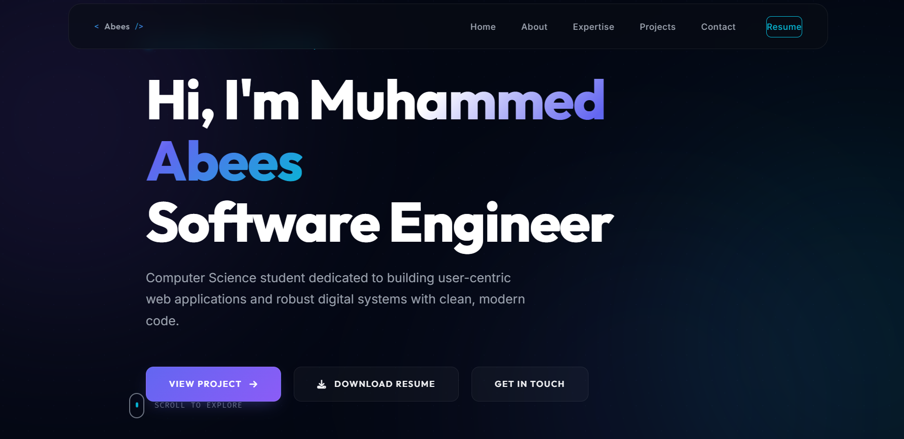

# 🌐 Personal Portfolio Website

## Overview

A personal portfolio website showcasing my projects, technical skills, certifications, and academic journey as a Computer Science Engineering student.

## Live Demo

🔗 https://muhammedabees.vercel.app

## Technologies Used

* HTML5
* CSS3
* JavaScript

## Features

* Responsive Design
* Project Showcase
* Skills Section
* Certifications
* Resume Access
* Contact Information

## Preview

## About Me

I am a B.Tech Computer Science Engineering student interested in full-stack web development, software engineering, and problem-solving. I use this portfolio to showcase my work and learning journey.

## Connect With Me

💼 LinkedIn: https://www.linkedin.com/in/muhammedabees/

🐙 GitHub: https://github.com/Abeess
